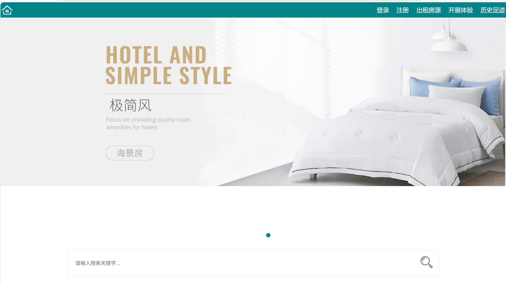
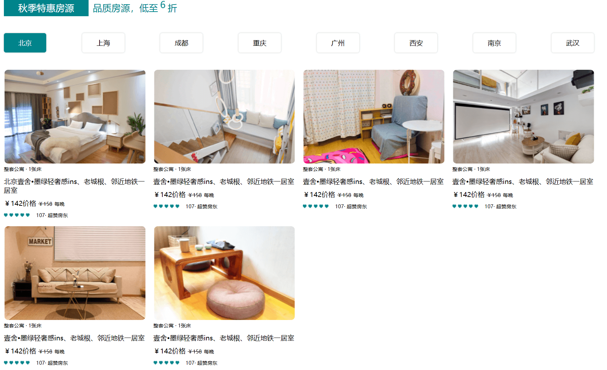
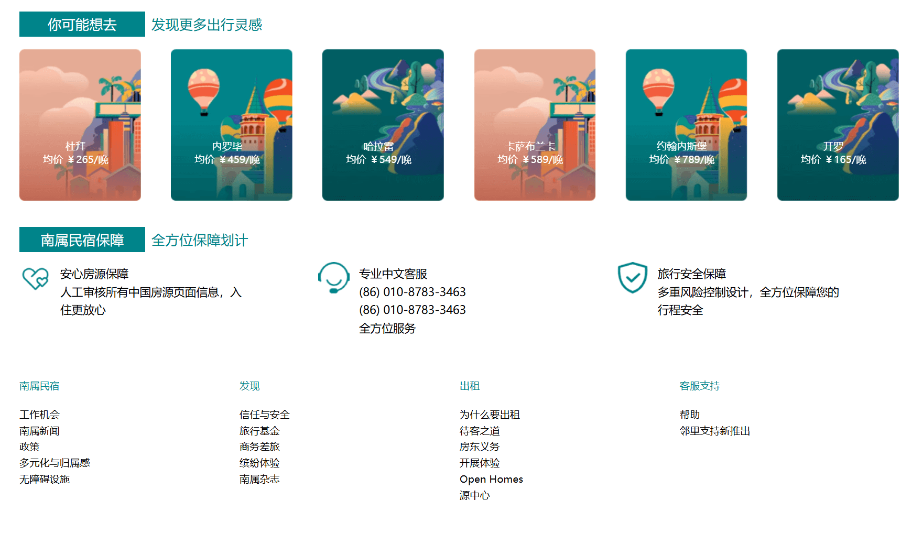

# 🏡 南属民宿首页开发（本地版）

```markdown
> 项目作者：Jia'nan Zhao
> 项目时间：2021年6月  
> 所属课程：《计算机网络》课程设计  
> 技术栈：HTML5 + CSS3 + JavaScript + Photoshop
```

---

## 📌 项目概述

本项目旨在设计并实现一个民宿酒店类网站的动态首页，借助 HTML、CSS、JavaScript 和图像处理工具 PS，在本地环境下完成首页开发和交互体验，实现界面布局、功能模块、导航交互等基本功能。

---

## 🎯 设计目标

- 掌握网页前端三大基础技术：HTML、CSS、JavaScript
- 掌握网站首页框架构建与设计流程
- 理解并实践网站导航、栏目、交互行为的实现方式
- 综合应用 DIV+CSS 布局，完成一个本地运行的民宿首页原型

---

## 🧩 技术架构

### 🌐 HTML5：内容结构

- 使用 `div` 模块化设计
- 语义化标签组织页面内容
- 实现登录、注册、房源发布、历史足迹等栏目入口

### 🎨 CSS3：样式设计

- 弹出式导航栏菜单
- 像素级精度控制布局
- 响应式适配设计部分模块

### ⚙️ JavaScript：页面行为

- 实现轮播图切换动画
- 城市房源信息 Tab 切换功能
- 动态高亮导航项

### 🖼️ Photoshop：图像切图

- 使用 PS 对首页 UI 元素进行切片
- 输出网页所需图片素材资源

---

## 🏗️ 页面结构图

### 📊 功能策划框架图

> 登录 / 注册 / 房源发布 / 体验活动 / 历史足迹 / 手机访问



> 首页轮播图 + 城市房源展示



> 推荐板块



---

## 🔨 开发过程

### 1. 利用 `DIV` 构建主页布局
```html
<div class="wrapperBox">
  <div class="navBox">
    <div class="navBar">
      <div class="logo"></div>
      <nav>
        <ul>
          <li><a href="#">登录</a></li>
          <li><a href="#">注册</a></li>
          <li><a href="#">出租房源</a></li>
          <li><a href="#">开展体验</a></li>
          <li><a href="#">历史足迹</a></li>
          <li><a href="#">手机端</a></li>
        </ul>
      </nav>
    </div>
  </div>
</div>
````

### 2. CSS 弹出式导航条菜单

```css
.navBox {
  width: 100%;
  height: 40px;
  background: #00848A;
}
.navBar nav ul li a {
  display: inline-block;
  height: 40px;
  line-height: 40px;
  padding: 0 10px;
  color: #fff;
}
```

### 3. JavaScript 动态效果

```javascript
window.onload = function () {
  var imgs = document.querySelectorAll(".img");
  var dots = document.querySelectorAll(".dots span");
  var currentIndex = 0;

  setInterval(function () {
    imgs[currentIndex].classList.remove("current");
    dots[currentIndex].classList.remove("square");
    currentIndex = (currentIndex + 1) % imgs.length;
    imgs[currentIndex].classList.add("current");
    dots[currentIndex].classList.add("square");
  }, 3000);
};
```

---

## ✨ 最终页面效果展示

* 首页导航流畅，功能分区清晰
* 页面内容丰富，结构合理
* 动态轮播图增强视觉吸引力
* 交互行为自然，操作直观

---

## 📚 个人心得

* 本次项目是对计算机网络与网页前端知识的综合应用实践
* 熟练掌握 HTML/CSS/JS 结构与语法，并实现了实际功能
* 学会使用 Sublime Text 进行网页开发
* 初步了解网页美学与用户体验的重要性

---


> 项目目前为本地静态页面，后续计划部署至线上服务器。

---

## 📖 参考文献

* 《计算机网络 第2版》沈红、李爱华主编，清华大学出版社，2015年7月
* W3C HTML5 / CSS3 / JavaScript 教程文档
* CSDN、掘金社区相关前端开发文章

---


